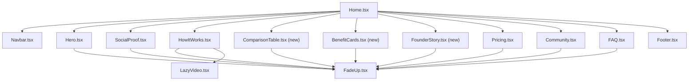

# Design Document: Homepage Design Overhaul

## Overview

This design covers a comprehensive visual overhaul of the Forrestry.ai homepage — the marketing landing page for Funnel Studio. The goal is to introduce breathing room, visual hierarchy, and section distinction while preserving the existing brand identity (dark-mode editorial SaaS aesthetic with green accent).

The overhaul touches every section of the homepage and introduces three new components. The work spans four categories:

1. **Global changes** — new CSS custom properties, reusable utility classes, alternating section backgrounds, consistent spacing and typography tokens
2. **Component modifications** — Hero, SocialProof, HowItWorks (complete rewrite), Pricing (complete rewrite), FAQ (complete rewrite), Footer, and Home view
3. **New components** — ComparisonTable, BenefitCards, FounderStory
4. **Removals** — FinalCTA component removed from the render order

All changes are scoped to the homepage route (`/`) and its component tree. No backend, API, or data-layer changes are involved. The site remains a static Astro build deployed to Vercel.

### Tech Stack

| Layer | Technology |
|-------|-----------|
| Framework | Astro 5.7 (static output) |
| UI | React 19 (TSX components) |
| Styling | Tailwind CSS v4 with `@theme` custom properties |
| Icons | lucide-react |
| Animations | Custom FadeUp (IntersectionObserver), LazyVideo, LazySection |
| Deployment | Vercel (static adapter) |

### Design Decisions

1. **Tailwind v4 @theme block over theme.ts** — The existing `globals.css` already defines CSS custom properties via `@theme`. New tokens (alternating backgrounds, section padding, max-width) will be added there rather than in `theme.ts`, keeping the single source of truth for Tailwind utilities. `theme.ts` remains for JS-side reference but is not the runtime styling authority.

2. **Reusable eyebrow as a CSS utility class** — Rather than a React component, the eyebrow styling is defined as a `.eyebrow` class in `globals.css`. This keeps it framework-agnostic and usable in any section without imports.

3. **LazyVideo for HowItWorks demo media** — Each feature item maps to an existing `/public/*.mp4` file. The existing `LazyVideo` component handles lazy-loading and autoplay on intersection, so no new media infrastructure is needed.

4. **Static FAQ cards over accordion** — The current FAQ uses `useState` for accordion toggling. The redesign removes all interactivity in favor of a static 2-column card grid, simplifying the component and improving scannability.

5. **Single pricing block** — The current 3-plan layout (Starter $97, Pro $147, Annual $997) is replaced with a single founding-member block ($47/mo, $97 strikethrough). This is a deliberate content/structure change per the requirements.

6. **FinalCTA removal** — The FinalCTA component duplicates the pricing CTA. Removing it tightens the page ending: Pricing → Footer.

## Architecture

The homepage architecture remains a flat component composition rendered by `src/views/Home.tsx`. No routing, state management, or data fetching changes are needed.

### Current Section Order

```
Navbar → Hero → SocialProof → HowItWorks → Pricing → Community → FinalCTA → Footer
```

### New Section Order

```
Navbar → Hero → SocialProof → HowItWorks → ComparisonTable → BenefitCards → FounderStory → Pricing → Community → FAQ → Footer
```

Changes:
- **ComparisonTable** inserted after HowItWorks (reinforces value proposition after feature walkthrough)
- **BenefitCards** inserted after ComparisonTable (positive outcomes after comparison)
- **FounderStory** inserted before Pricing (builds trust before the ask)
- **FinalCTA removed** from the render order
- **FAQ moved** to after Community (answers objections near the end)

### Alternating Background Pattern

Sections alternate between two dark tones to create visual separation:

| Section | Background |
|---------|-----------|
| Hero | `#0a0f0a` (inherits from body, no explicit bg needed — uses radial glow) |
| SocialProof | `#0f160f` |
| HowItWorks | `#0a0f0a` |
| ComparisonTable | `#0f160f` |
| BenefitCards | `#0a0f0a` |
| FounderStory | `#0f160f` |
| Pricing | `#0a0f0a` |
| Community | `#0f160f` |
| FAQ | `#0a0f0a` |
| Footer | `#050505` (existing) |

### File Change Map

```
Modified files:
  src/styles/globals.css          — new tokens, eyebrow class, body line-height
  src/views/Home.tsx              — new section order, new imports, remove FinalCTA
  src/components/Hero.tsx         — eyebrow styling, radial glow, chip styling, price opacity
  src/components/SocialProof.tsx  — 2x2 grid, left border accent, larger titles
  src/components/HowItWorks.tsx   — complete rewrite: alternating layout with video frames
  src/components/Pricing.tsx      — complete rewrite: single founding-member block
  src/components/FAQ.tsx          — complete rewrite: static 2-column card grid
  src/components/Footer.tsx       — tagline prop, top border
  src/components/Community.tsx    — background token, section padding

New files:
  src/components/ComparisonTable.tsx  — 3-column comparison table
  src/components/BenefitCards.tsx     — 3-column benefit card grid
  src/components/FounderStory.tsx     — founder photo, blockquote, footnote
```

### Component Dependency Diagram



## Components and Interfaces

### 1. Global CSS Changes (`src/styles/globals.css`)

**New @theme tokens:**

```css
@theme {
  /* Existing tokens preserved... */

  /* New: alternating section backgrounds */
  --color-bg-section-a: #0a0f0a;
  --color-bg-section-b: #0f160f;

  /* New: section layout */
  --spacing-section-y: 120px;
  --spacing-section-y-mobile: 64px;
  --spacing-section-max-w: 1100px;
}
```

**New utility class:**

```css
/* Reusable eyebrow label */
.eyebrow {
  font-size: 11px;
  letter-spacing: 0.15em;
  font-weight: 600;
  color: var(--color-green);
  text-transform: uppercase;
}
```

**Body line-height update:**

```css
body {
  line-height: 1.75;
}
```

### 2. Hero.tsx Modifications

**Props:** No prop changes (stateless component).

**Visual changes:**
- Eyebrow badge: increase letter-spacing to `0.15em`, bump font-size to `13px`
- Add a radial gradient glow behind the headline: `radial-gradient(circle at 50% 50%, rgba(74,222,128,0.06) 0%, transparent 70%)`
- CTA-to-chips gap: set `32px` (`mb-8`) between the price text and the badge grid
- Proof chips: `py-4 px-5`, border `1px solid rgba(255,255,255,0.08)`, bg `rgba(255,255,255,0.04)`
- Price text: opacity `0.7` (currently `0.5`)
- Apply `.eyebrow` class to the "Beta Now Open" label
- Constrain content to `max-w-[1100px]`

### 3. HowItWorks.tsx — Complete Rewrite

**Data structure:**

```typescript
interface FeatureItem {
  num: string           // "01" through "06"
  title: string         // e.g. "Brain Dump™"
  subtitle: string      // e.g. "Turn a messy idea into a strategic offer"
  desc: string          // paragraph description
  videoSrc: string      // path to /public/*.mp4
}
```

**Feature-to-video mapping:**

| # | Feature | Video |
|---|---------|-------|
| 01 | Brain Dump™ | `/Brain-Dump-Demo.mp4` |
| 02 | Webinar Builder | `/webinar-builder.mp4` |
| 03 | 60-Sec Webinar | `/60-Second-Hook.mp4` |
| 04 | Strategic Blueprint | `/Strategic Blueprint.mp4` |
| 05 | Funnel Stack | `/Funnel Stack.mp4` |
| 06 | Social Ads + Email Writer | `/Email-Writer.mp4` |

**Layout:**
- Alternating left/right: odd items (01, 03, 05) have text-left / video-right; even items (02, 04, 06) have video-left / text-right
- Each item is a 2-column grid (`grid-cols-2` on desktop, stacked on mobile with text above video)
- Section marker: 64px circle with green gradient (`bg-gradient-to-br from-green to-green-bright`), positioned at the top-left of each item, containing the step number
- GIF frame styling: `rounded-xl` (12px), border `1px solid rgba(74,222,128,0.2)`, `border-t-2 border-t-green`, `shadow-[0_24px_64px_rgba(0,0,0,0.4)]`
- Title: `text-[28px] md:text-[32px] font-bold`
- Title-to-body gap: `16px`
- Uses `LazyVideo` component for each video
- Vertical gap between items: `96px`

**Closing thesis statement:**
- Centered italic text after the last feature item
- `text-[22px]`, `opacity-85`, `my-20` (80px vertical margin)
- Content: *"This is not a collection of tools. It is a system. Each piece feeds the next, so nothing falls through the cracks and nothing slows you down."*

**Section header:**
- Eyebrow: "INSIDE FUNNEL STUDIO" using `.eyebrow` class
- Headline: "Your entire funnel. Built in the right order."

### 4. ComparisonTable.tsx — New Component

**Props:** None (self-contained data).

**Data structure:**

```typescript
interface ComparisonRow {
  label: string
  diy: string
  agency: string
  funnelStudio: string
}
```

**Comparison rows:**

| Aspect | DIY | Agency | Funnel Studio |
|--------|-----|--------|---------------|
| Time to launch | 3-6 months | 4-8 weeks | Under 48 hours |
| Cost | $2,000-5,000 in tools | $10,000-25,000+ | $47/mo |
| Copy & scripts | You write everything | Copywriter writes for you | AI generates from your Brain Dump |
| Funnel strategy | You figure it out | Strategist plans it | Built-in frameworks |
| Revisions | Start over each time | $150/hr for changes | Unlimited, instant |
| Email sequences | Manual setup | Included (maybe) | Auto-generated, connected |
| Ongoing support | Forums, YouTube | Retainer fees | Community + updates |

**Layout:**
- 3-column table on desktop
- Funnel Studio column: `bg-[rgba(74,222,128,0.06)]`, left/right borders `1px solid rgba(74,222,128,0.3)`, top accent `3px solid #4ade80`, header text in green, bold, larger font
- DIY and Agency columns: text at `opacity-45`
- Alternating row backgrounds: `rgba(255,255,255,0.02)` on even rows
- CTA row at bottom spanning full width
- Mobile: collapses to single-column card showing only Funnel Studio values with row labels

**Section header:**
- Eyebrow: "THE COMPARISON" using `.eyebrow` class
- Headline: "See how Funnel Studio stacks up."

### 5. SocialProof.tsx Modifications

**Changes:**
- Grid: already `grid-cols-1 md:grid-cols-2` — keep the 2x2 layout, add `gap-6` (24px)
- Pain card: add `border-l-4 border-l-[rgba(74,222,128,0.4)]` left accent
- Pain card padding: `p-7` (28px)
- Emoji size: `text-[32px]`
- Title: `text-[18px] font-semibold` (currently `text-2xl font-bold`)
- Apply `.eyebrow` class to the "THE PROBLEM" label
- Constrain to `max-w-[1100px]`
- Background: `bg-bg-section-b`
- Section padding: `py-[120px] md:py-[120px] py-[64px]` (using responsive padding)

### 6. BenefitCards.tsx — New Component

**Props:** None (self-contained data).

**Data structure:**

```typescript
interface BenefitCard {
  icon: string       // emoji
  headline: string
  description: string
}
```

**Card content:**

1. 🚀 **"Launch in days, not months"** — "Stop waiting for the perfect funnel. Brain Dump your idea, and Funnel Studio builds the copy, the pages, and the sequences. You launch while others are still outlining."
2. 💬 **"Every piece speaks the same language"** — "Your webinar script, your emails, your ads — they all come from one strategic conversation. No Frankenstein funnels. No messaging drift."
3. 📈 **"Built on frameworks that convert"** — "The Perfect Webinar. Hook-Story-Offer. Soap Opera Sequences. These are not templates. They are proven structures baked into every output."

**Layout:**
- 3-column grid on desktop (`grid-cols-3`), single column on mobile
- Gap: `20px`
- Card: `bg-[rgba(255,255,255,0.04)]`, border `1px solid rgba(255,255,255,0.08)`, `rounded-xl` (12px), `p-8` (32px)
- Icon: `text-[36px]`, `mb-4` (16px bottom margin)
- Headline: `text-[20px] font-bold`
- Hover: `border-[rgba(74,222,128,0.3)]`, `translate-y-[-2px]`, `transition-all duration-200`

**Section header:**
- Eyebrow: "THE OUTCOME" using `.eyebrow` class
- Headline: "What changes after Funnel Studio."

### 7. FounderStory.tsx — New Component

**Props:** None (self-contained content).

**Layout:**
- Centered layout, max-width `700px`
- Founder photo: `120px` diameter circle, `border-[3px] border-green`, `shadow-[0_0_30px_rgba(74,222,128,0.2)]`, src `/founder.webp`
- Blockquote: `text-[20px]`, `italic`, `border-l-4 border-l-green`, `pl-6` (24px left padding), `text-green`
- Quote content: *"I built Funnel Studio because I was tired of watching smart entrepreneurs get stuck in the gap between having a great offer and getting it in front of people. This tool is the bridge."*
- Attribution: "— Forrest, Founder of forrestry.ai"
- Footnote: `text-[14px]`, `opacity-60`
- Footnote content: "Funnel Studio was born from real launches, real failures, and real frameworks that work."

**Section header:**
- Eyebrow: "THE FOUNDER" using `.eyebrow` class
- Headline: "Built by a launcher, for launchers."

### 8. FAQ.tsx — Complete Rewrite

**Changes:**
- Remove `useState` import and accordion state logic
- Layout: 2-column grid on desktop (`grid-cols-2`), single column on mobile
- FAQ card: `p-7` (28px), `rounded-xl` (12px), border `1px solid rgba(255,255,255,0.08)`
- Question: `text-[17px] font-bold text-white`
- Answer: `text-[15px] opacity-75 leading-[1.7]`
- Keep existing FAQ data array unchanged
- Apply `.eyebrow` class to the "FAQ" label
- Render as `<div>` instead of `<button>` (no interactivity)

### 9. Pricing.tsx — Complete Rewrite

**Changes:**
- Replace 3-plan grid with a single centered pricing block
- Max-width: `700px`, centered

**Pricing block structure:**
- Eyebrow: "FOUNDING MEMBER PRICING" using `.eyebrow` class
- Headline: "Lock in the founding rate."
- Strikethrough price: `$97/mo` at `opacity-50`, `text-[16px]`, `line-through`
- Active price: `$47/mo` at `text-[48px] font-extrabold`
- Discount pill: "52% off" with `bg-[rgba(74,222,128,0.15)]`, `rounded` (4px), `px-2.5 py-1`
- Checklist items (green checkmarks, 12px gap):
  - "Full Funnel Studio access"
  - "AI copywriting engine"
  - "Webinar script builder"
  - "Email sequence generator"
  - "Ad copy writer"
  - "Community access"
  - "14-Day Money-Back Guarantee"
- CTA button: same style as current Hero CTA
- Trust badges: `text-[13px]`, separated by ` · `: "Cancel anytime · No credit card required · 14-day money-back guarantee"
- Progress bar: "23 of 100 spots claimed" (carried over from FinalCTA)

### 10. Home.tsx Modifications

**Changes:**
- Add imports for `ComparisonTable`, `BenefitCards`, `FounderStory`
- Remove `FinalCTA` import
- Update render order to new section sequence
- Update nav links to reflect new sections (add "FAQ" link)

**New render order:**
```tsx
<Navbar ... />
<Hero />
<SocialProof />
<HowItWorks />
<ComparisonTable />
<BenefitCards />
<FounderStory />
<Pricing />
<Community />
<FAQ />
<Footer tagline="Stop Building. Start Launching." />
```

### 11. Footer.tsx Modifications

**Changes:**
- Pass `tagline="Stop Building. Start Launching."` prop (already supported via existing `tagline` prop)
- Update border: `border-t border-[rgba(255,255,255,0.08)]` (currently `border-[#1F1F1F]` which is close but not exact)
- Tagline styling: `text-[14px] font-medium text-green` (the existing component renders tagline as `text-muted text-sm` — update to green, font-medium)

### 12. Community.tsx Modifications

**Changes:**
- Apply alternating background token `bg-bg-section-b`
- Apply section padding `py-[120px]` desktop / `py-16` mobile
- Constrain to `max-w-[1100px]`
- Apply `.eyebrow` class to "THE COMMUNITY" label

## Data Models

No persistent data models are involved. All content is hardcoded in component files as static arrays and objects. The data structures are:

### FeatureItem (HowItWorks)
```typescript
interface FeatureItem {
  num: string
  title: string
  subtitle: string
  desc: string
  videoSrc: string
}
```

### ComparisonRow (ComparisonTable)
```typescript
interface ComparisonRow {
  label: string
  diy: string
  agency: string
  funnelStudio: string
}
```

### BenefitCardData (BenefitCards)
```typescript
interface BenefitCardData {
  icon: string
  headline: string
  description: string
}
```

### FAQItem (FAQ)
```typescript
interface FAQItem {
  q: string
  a: string
}
```

These are all render-time constants with no serialization, persistence, or API interaction.

## Error Handling

This feature involves static marketing page components with no API calls, user input processing, or async data fetching. Error handling is minimal:

1. **Image loading** — The `FounderStory` component references `/founder.webp`. If the image fails to load, the browser renders the `alt` text. No custom error boundary is needed since this is a static asset already present in `/public/`.

2. **Video loading** — The `HowItWorks` rewrite uses `LazyVideo` for demo videos. The existing `LazyVideo` component sets `src={isVisible ? src : undefined}`, which gracefully handles the case where the video hasn't entered the viewport. If a video file is missing, the `<video>` element renders as an empty box. Since all referenced videos already exist in `/public/`, this is a deployment concern, not a runtime one.

3. **Missing CSS custom properties** — If a new `@theme` token is referenced but not defined (e.g., `bg-bg-section-a`), Tailwind v4 will not generate the utility class, and the element falls back to no background. This is caught at build time by visual inspection.

4. **Component import errors** — If a new component (ComparisonTable, BenefitCards, FounderStory) is imported in `Home.tsx` but the file doesn't exist, the Astro build fails immediately with a clear error. This is caught during development.

No error boundaries, try/catch blocks, or fallback UI are required for this feature.

## Testing Strategy

### Why Property-Based Testing Does Not Apply

This feature is a **UI rendering and visual styling overhaul**. Every acceptance criterion describes visual properties: padding values, font sizes, colors, border styles, grid layouts, and component ordering. These are:

- **Not pure functions** — there is no input/output behavior to vary
- **Not data transformations** — no serialization, parsing, or business logic
- **Deterministic rendering** — the same component always produces the same HTML given the same static data
- **Visual in nature** — correctness is verified by inspecting rendered output, not by asserting over a range of inputs

Per the PBT guidelines, UI rendering and layout changes should use **snapshot tests and visual regression tests**, not property-based tests.

### Recommended Testing Approach

#### 1. Visual Regression Testing (Primary)

The most effective way to verify this overhaul is visual regression testing. Each section's rendered output should be captured as a screenshot baseline and compared after changes.

**What to capture:**
- Full-page screenshot at 1440px (desktop) and 375px (mobile) widths
- Individual section screenshots for Hero, SocialProof, HowItWorks, ComparisonTable, BenefitCards, FounderStory, Pricing, Community, FAQ, Footer

**Tools:** Playwright's screenshot comparison or Percy/Chromatic if available.

#### 2. Build Verification (Required)

```bash
npm run build
```

The Astro static build must complete without errors. This validates:
- All component imports resolve
- All TypeScript types are correct
- All Tailwind utilities generate valid CSS
- No missing dependencies

#### 3. Manual Checklist Testing

For each requirement, verify the rendered output against the acceptance criteria:

| Requirement | Verification Method |
|-------------|-------------------|
| R1: Global spacing | Inspect computed styles: section padding 120px/64px, max-width 1100px, line-height 1.75 |
| R2: Eyebrow class | Inspect `.eyebrow` elements: 11px, 0.15em spacing, weight 600, green |
| R3: Typography scale | Inspect headlines: 40-48px desktop, 28-32px mobile; body 16px opacity 0.8 |
| R4: Hero refinements | Inspect radial glow, chip padding/border, price opacity 0.7 |
| R5: Feature alternating layout | Verify odd items text-left/video-right, even items reversed |
| R6: Closing statement | Verify centered italic text, 22px, opacity 0.85, 80px margins |
| R7: Comparison table | Verify 3 columns, green highlight, mobile collapse |
| R8: Pain cards | Verify 2x2 grid, left border accent, 28px padding |
| R9: Benefit cards | Verify 3-column grid, hover states, mobile stack |
| R10: Founder story | Verify photo ring, blockquote styling, footnote |
| R11: FAQ cards | Verify 2-column grid, static cards, no accordion |
| R12: Pricing block | Verify single block, strikethrough, discount pill, trust badges |
| R13: FinalCTA removed | Verify no FinalCTA in rendered page |
| R14: Footer | Verify tagline text and top border |
| R15: Git branch | Verify changes are on a dedicated branch |

#### 4. Responsive Testing

Test at three breakpoints:
- **Desktop**: 1440px — full grid layouts, 120px section padding
- **Tablet**: 768px — verify breakpoint transitions
- **Mobile**: 375px — single-column stacks, 64px section padding, ComparisonTable collapses

#### 5. Accessibility Checks

- All images have `alt` attributes (founder photo, logo)
- Videos have `muted` and `playsInline` attributes (existing LazyVideo handles this)
- Color contrast: green (#4ade80) on dark backgrounds meets WCAG AA for large text
- Semantic HTML: sections use `<section>` elements, headings follow hierarchy
- FAQ cards remain readable without interaction (no hidden content behind accordions)

Note: Full WCAG compliance validation requires manual testing with assistive technologies and expert accessibility review.

