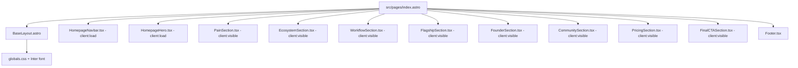

# Design Document: Homepage Rebirth

## Overview

This design covers the complete rebuild of the Forrestry.ai root homepage (`/`). The existing `company/` components are replaced by a new set of isolated components in `src/components/homepage/`. The page follows a HubSpot-inspired visual direction: dark hero, light/white body sections, clean cards, green CTAs, and a dark closing section.

The architecture uses Astro 5.7 as the static site generator with React 19 islands for interactive components. Tailwind CSS v4 handles styling via utility classes and the existing `@theme` configuration in `globals.css`. All components are React `.tsx` files rendered through Astro's `client:load` or `client:visible` directives.

The page positions Forrestry.ai as a connected growth ecosystem (parent brand, green #4ade80 accent) with Funnel Studio as the flagship product (purple #7C3AED accent used only on the Funnel Studio product card tag).

## Architecture

### Page Rendering Flow



### Hydration Strategy

| Component | Directive | Rationale |
|-----------|-----------|-----------|
| HomepageNavbar | `client:load` | Needs immediate interactivity (scroll detection, dropdown, mobile menu) |
| HomepageHero | `client:load` | Above the fold, needs immediate scroll animation |
| PainSection | `client:visible` | Below fold, lazy hydrate for performance |
| EcosystemSection | `client:visible` | Below fold |
| WorkflowSection | `client:visible` | Below fold |
| FlagshipSection | `client:visible` | Below fold |
| FounderSection | `client:visible` | Below fold |
| CommunitySection | `client:visible` | Below fold |
| PricingSection | `client:visible` | Below fold |
| FinalCTASection | `client:visible` | Below fold |
| Footer | None (static) | No interactivity needed, renders as static HTML |

### Directory Structure

```
src/components/homepage/
├── HomepageNavbar.tsx
├── HomepageHero.tsx
├── PainSection.tsx
├── EcosystemSection.tsx
├── WorkflowSection.tsx
├── FlagshipSection.tsx
├── FounderSection.tsx
├── CommunitySection.tsx
├── PricingSection.tsx
└── FinalCTASection.tsx
```

The existing `src/components/company/` directory remains untouched for revert safety.

## Components and Interfaces

### HomepageNavbar

```typescript
interface HomepageNavbarProps {
  // No props needed; all config is internal
}
```

**Behavior:**
- Fixed position (`fixed top-0 left-0 right-0 z-50`)
- Transparent background on hero (dark section), transitions to white background with subtle shadow after scrolling past the hero (~100vh or a threshold like 80px)
- Logo: `/logo.png` linking to `/`
- Nav links: "Products" (dropdown trigger), "Pricing" (`/pricing`), "About" (`/about`)
- Products dropdown contains:
  - "Funnel Studio" linking to `/funnel-studio`
  - "AYA (Coming Soon)" linking to `#ecosystem`
  - "BrandStory (Coming Soon)" linking to `#ecosystem`
- Primary CTA: "Get Access to Funnel Studio" linking to Stripe checkout URL
- Mobile: hamburger menu below 768px, full-screen overlay with same links
- Scroll state detection via `useState` + `useEffect` with scroll listener

**Dark vs Light mode logic:**
- `scrolled === false`: transparent bg, white text, white logo
- `scrolled === true`: `bg-white shadow-sm`, dark text (#1C1917), green CTA button

### HomepageHero

```typescript
interface HomepageHeroProps {
  // No props; copy is hardcoded per requirements
}
```

**Layout:**
- Full viewport height or near-full (min-h-screen or min-h-[90vh])
- Dark background: `bg-[#09090B]`
- Centered content with max-width container
- Headline: "Build Your Business on a Clear Path. Not a Pile of Disconnected Tools."
- Subheadline: Short paragraph describing Forrestry.ai as the growth ecosystem
- Primary CTA: Green button "Get Access to Funnel Studio" (links to Stripe checkout)
- Secondary CTA: Text link "See How the Ecosystem Works" (scrolls to `#ecosystem`)
- Visual element: Abstract system map or interface mockup placeholder (CSS/SVG graphic showing connected nodes)
- Green accent (#4ade80) on headline keywords and CTA

### PainSection

```typescript
interface PainSectionProps {
  // No props
}
```

**Layout:**
- Light background: `bg-[#FAFAF9]` or `bg-white`
- Section padding: `py-24 px-6`
- Max-width container: `max-w-[1100px] mx-auto`
- Headline: "The 'Digital Jungle' is real. We're here to help you navigate it."
- Three cards in a responsive grid (1 col mobile, 3 col desktop)
- Each card: white bg, `border border-gray-200`, `rounded-2xl`, `shadow-sm`, padding, icon area, title, body paragraph
- Transition line below cards: "Forrestry.ai was built to replace that chaos with a single, connected ecosystem."

**Card content:**
1. Technical Exhaustion: about spending time configuring tools instead of building
2. Strategic Confusion: about having no clear path from idea to revenue
3. Fragmented Systems: about tools that don't talk to each other

**Text colors:**
- Headline: `text-[#1C1917]` (near-black)
- Body: `text-[#4B5563]` (gray-600)
- Card titles: `text-[#1C1917]`

### EcosystemSection

```typescript
interface EcosystemSectionProps {
  // No props
}
```

**Layout:**
- `id="ecosystem"` for anchor navigation
- Light background: `bg-white`
- Headline: "One Connected Ecosystem. Three Engines for Growth."
- Three product cards in responsive grid

**Funnel Studio card (live):**
- White bg, green border-top or accent line
- Tag: "THE CONVERSION ENGINE" in green
- Title: "Funnel Studio"
- Description paragraph
- CTA button: "Explore Funnel Studio" linking to `/funnel-studio`
- Full color, full opacity

**AYA card (coming soon):**
- Glassmorphism effect: `bg-white/60 backdrop-blur-sm`
- Grayscale filter or reduced opacity (0.6)
- Tag: "COMING SOON" in muted gray
- Title: "AYA"
- Subtitle: "The Audience Intelligence Engine"
- No CTA button

**BrandStory card (coming soon):**
- Same glassmorphism/grayscale treatment as AYA
- Tag: "COMING SOON" in muted gray
- Title: "BrandStory"
- Subtitle: "The Brand Narrative Engine"
- No CTA button

### WorkflowSection

```typescript
interface WorkflowSectionProps {
  // No props
}
```

**Layout:**
- Light background: `bg-[#FAFAF9]`
- Headline: "Strategy into Execution. The Forrestry Path."
- Four steps displayed vertically or in a 2x2 grid on desktop
- Each step has: number badge (1-4), title, description paragraph
- Visual connection between steps: vertical line or connector on desktop, numbered badges on mobile

**Steps:**
1. "The Brain Dump" - Extract your expertise through a guided conversation
2. "The Strategic Blueprint" - AI transforms your brain dump into a complete funnel strategy
3. "The Funnel Stack" - Your strategy becomes a live, connected 4-page funnel
4. "Scale Authority" - Expand with emails, ads, and content from your unified voice

**Timeline visual:**
- Left-aligned numbers in green circles
- Vertical connecting line between circles (green, thin)
- Content to the right of each number
- On mobile: stacked vertically with numbers above content

### FlagshipSection

```typescript
interface FlagshipSectionProps {
  // No props
}
```

**Layout:**
- Light background: `bg-white`
- Headline: "Meet Funnel Studio: Where Your Vision Becomes a Reality."
- Three value pillars in a responsive grid (1 col mobile, 3 col desktop)
- Each pillar: icon/visual, title, description
- CTA button at bottom: "Launch Your First Ecosystem with Funnel Studio ($97)" linking to Stripe checkout

**Value pillars:**
1. "The Funnel Stack Builder" - Complete 4-page funnel generated from your strategy
2. "Framework-Driven Copy" - Every word written using proven conversion frameworks
3. "A Unified Voice" - All content sounds like you, across every touchpoint

### FounderSection

```typescript
interface FounderSectionProps {
  // No props
}
```

**Layout:**
- Slightly tinted background: `bg-[#F5F5F4]` (warm gray)
- Two-column layout on desktop (photo left, copy right), stacked on mobile
- Headline: "Built by a Marketing Professional Who's Been in the Trenches."
- Founder photo: ``
- Photo styling: rounded corners, subtle shadow
- Copy: narrative about 7+ years with global B2B brands and enterprise GTM systems
- Mission statement: giving entrepreneurs access to the same professional-grade platforms that enterprise teams use

### CommunitySection

```typescript
interface CommunitySectionProps {
  // No props
}
```

**Layout:**
- Light background: `bg-white`
- Centered text layout
- Headline: "Join the Community of Forresters."
- Body copy about joining a network of entrepreneurs building real systems
- Optional: subtle decorative element (green accent line or dots)

### PricingSection

```typescript
interface PricingSectionProps {
  // No props
}
```

**Layout:**
- Light background: `bg-[#FAFAF9]`
- Headline: "One Mission. One Ecosystem. One Clear Price."
- Single centered pricing card
- Card: white bg, border, rounded-2xl, shadow-md, generous padding
- Price display: "$97" large, "/mo" smaller, no strikethrough, no discount
- Includes list with checkmarks:
  - Full Access to Funnel Studio
  - Brain Dump Genius Extraction
  - Strategic Blueprint Generation
  - The 4-Page HTML Funnel Stack Builder
  - Full Conversion Asset Suite (Emails, Ads, Scripts)
- CTA button: "Get Access to Funnel Studio" linking to Stripe checkout
- No founding member language, no urgency messaging, no discount badges

### FinalCTASection

```typescript
interface FinalCTASectionProps {
  // No props
}
```

**Layout:**
- Dark background: `bg-[#09090B]`
- Centered content
- Headline: "Stop Wrestling with Tools. Start Building Your Legacy."
- Subheadline: about the path to revenue starting with clarity
- CTA button: Green "Start with Funnel Studio" linking to Stripe checkout
- White text on dark background

### Updated index.astro

The page file imports all new components and renders them in order:

```astro
---
import BaseLayout from '../layouts/BaseLayout.astro'
import HomepageNavbar from '../components/homepage/HomepageNavbar'
import HomepageHero from '../components/homepage/HomepageHero'
import PainSection from '../components/homepage/PainSection'
import EcosystemSection from '../components/homepage/EcosystemSection'
import WorkflowSection from '../components/homepage/WorkflowSection'
import FlagshipSection from '../components/homepage/FlagshipSection'
import FounderSection from '../components/homepage/FounderSection'
import CommunitySection from '../components/homepage/CommunitySection'
import PricingSection from '../components/homepage/PricingSection'
import FinalCTASection from '../components/homepage/FinalCTASection'
import Footer from '../components/Footer'
---
```

Meta title: "forrestry.ai | The Entrepreneurial Growth Ecosystem"
Meta description: "Build your business on a clear path. Forrestry.ai connects strategy, funnels, and content into one ecosystem so you can stop wrestling with disconnected tools."

## Data Models

This feature has no persistent data models. All content is hardcoded in components (static marketing page). The only external data reference is the Stripe checkout URL (`https://buy.stripe.com/8x24gAcdt2nN2nOdi6frW01`) used in CTA buttons.

**Shared constants (can be extracted to a constants file if desired):**

```typescript
// src/components/homepage/constants.ts
export const STRIPE_CHECKOUT_URL = 'https://buy.stripe.com/8x24gAcdt2nN2nOdi6frW01'
export const FUNNEL_STUDIO_URL = '/funnel-studio'
export const ECOSYSTEM_ANCHOR = '#ecosystem'
```

## Error Handling

Since this is a static marketing page with no API calls or dynamic data fetching, error handling is minimal:

| Scenario | Handling |
|----------|----------|
| Image fails to load (logo, founder photo) | `alt` text displays; layout does not shift (explicit width/height or aspect-ratio on containers) |
| JavaScript fails to hydrate | Page content is still visible as static HTML rendered by Astro SSG; interactive features (dropdown, mobile menu, scroll animations) degrade gracefully |
| Stripe checkout link unreachable | External link opens in new tab; no client-side error to handle |
| Scroll-to-anchor target missing | Browser ignores the hash; no crash |
| CSS/font fails to load | System font fallback (`system-ui, -apple-system, sans-serif`) defined in `@theme` |

**Accessibility error prevention:**
- All `` tags include descriptive `alt` attributes
- All interactive elements (buttons, links, dropdown triggers) are keyboard-focusable
- Dropdown uses `aria-expanded`, `aria-haspopup`, and `role="menu"` attributes
- Mobile menu toggle uses `aria-label`
- Color contrast: green (#4ade80) on dark (#09090B) = 8.2:1 ratio (passes AAA); dark text (#1C1917) on light (#FAFAF9) = 16.5:1 ratio (passes AAA)

## Testing Strategy

### Why Property-Based Testing Does Not Apply

This feature consists entirely of UI rendering, layout, and navigation behavior. There are no pure functions with meaningful input/output variation, no parsers, no serializers, and no data transformations. The acceptance criteria describe visual presentation, specific copy, and navigation interactions. These are best validated through example-based tests, visual regression, and integration tests.

### Unit Tests (Example-Based)

Using Vitest + React Testing Library:

- **HomepageNavbar**: Verify logo renders, nav links present, dropdown opens on click, CTA button has correct href, scroll state changes background class
- **HomepageHero**: Verify headline text, CTA links, secondary CTA href points to `#ecosystem`
- **PainSection**: Verify three cards render with correct titles
- **EcosystemSection**: Verify `id="ecosystem"` attribute, three product cards, Funnel Studio card has CTA, coming soon cards have grayscale/opacity treatment
- **WorkflowSection**: Verify four steps render in order with correct titles
- **FlagshipSection**: Verify three pillars render, CTA button present with Stripe link
- **FounderSection**: Verify founder image renders with alt text, headline present
- **PricingSection**: Verify $97/mo displayed, no strikethrough elements, includes list has 5 items, CTA links to Stripe
- **FinalCTASection**: Verify dark background class, headline, CTA button

### Integration Tests

- **Full page render**: Astro build completes without errors; all sections render in correct order
- **Navigation flow**: Clicking "See How the Ecosystem Works" scrolls to `#ecosystem` section
- **Responsive behavior**: Components render correctly at 320px, 768px, and 1280px viewports
- **Accessibility audit**: axe-core scan passes with no critical violations

### Visual Regression Tests (Optional)

- Screenshot comparison at desktop and mobile breakpoints using Playwright or similar
- Catches unintended style regressions when shared CSS changes

### Build Verification

- `astro build` completes successfully with no TypeScript errors
- No console warnings about missing images or broken imports
- Lighthouse performance score remains above 90 (static page, minimal JS)
